# Hi, I'm LYanl7 👋

Computer Science student at Fuzhou University.

---

<h3 align="left">💻 Programming Languages</h3>

  
  

<h3 align="left">🧩 Frameworks</h3>

  
  
  
  
  

<h3 align="left">🗄️ Data &amp; Messaging</h3>

  
  
  
  
  

<h3 align="left">🛠️ AI &amp; Tools</h3>

  
  
  
  
  
  

---

---

---

<picture>
  <source media="(prefers-color-scheme: dark)" srcset="https://raw.githubusercontent.com/LYanl7/LYanl7/output/github-contribution-grid-snake-dark.svg" />
  <source media="(prefers-color-scheme: light)" srcset="https://raw.githubusercontent.com/LYanl7/LYanl7/output/github-contribution-grid-snake.svg" />
  
</picture>

