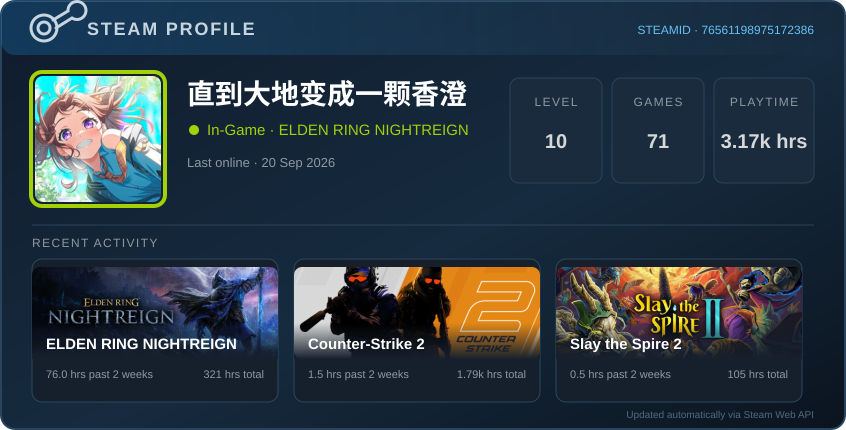

# Hi, I'm LYanl7 👋

Welcome to my GitHub profile.

## GitHub Stats

## Steam Activity

## Contribution Snake

<picture>
  <source media="(prefers-color-scheme: dark)" srcset="https://raw.githubusercontent.com/LYanl7/LYanl7/output/github-contribution-grid-snake-dark.svg" />
  <source media="(prefers-color-scheme: light)" srcset="https://raw.githubusercontent.com/LYanl7/LYanl7/output/github-contribution-grid-snake.svg" />
  
</picture>

